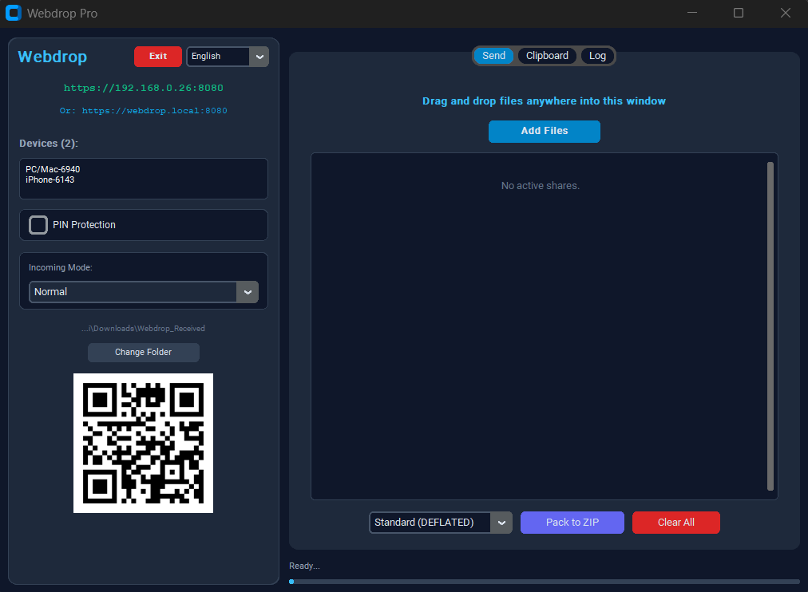
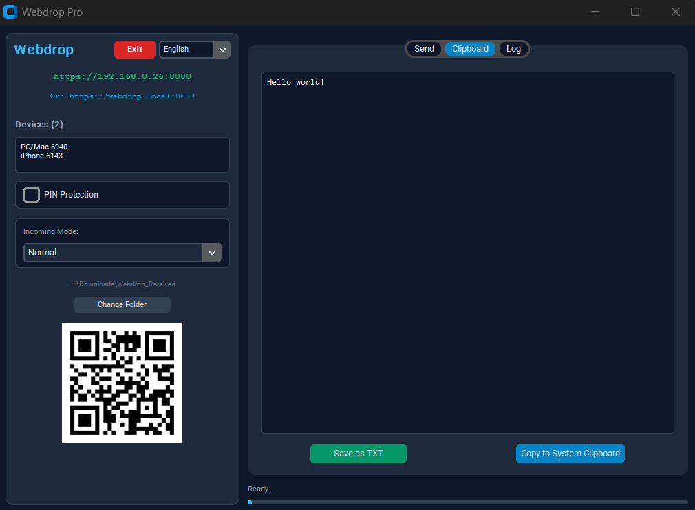
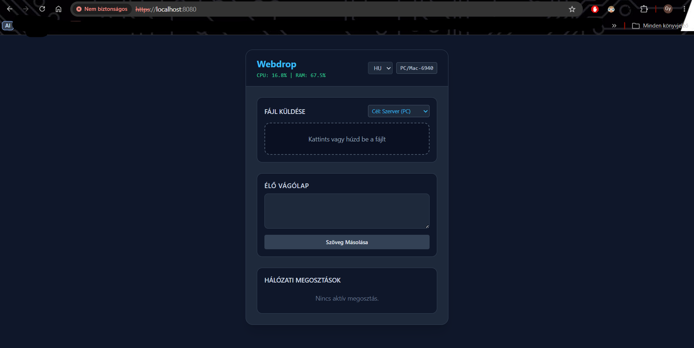
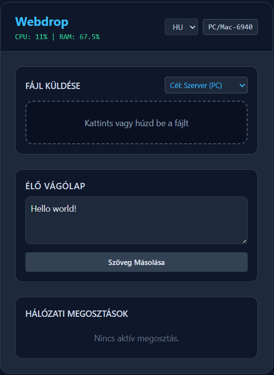
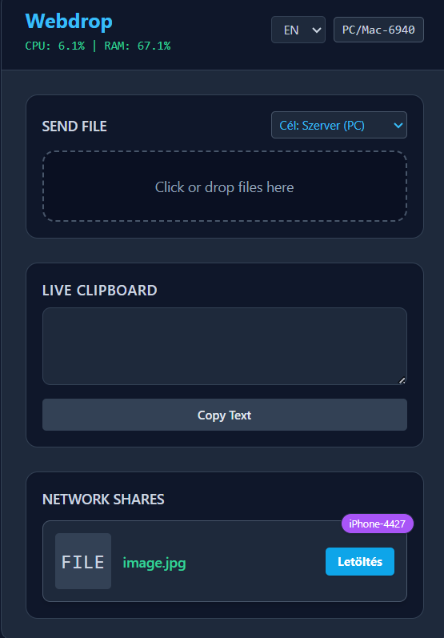
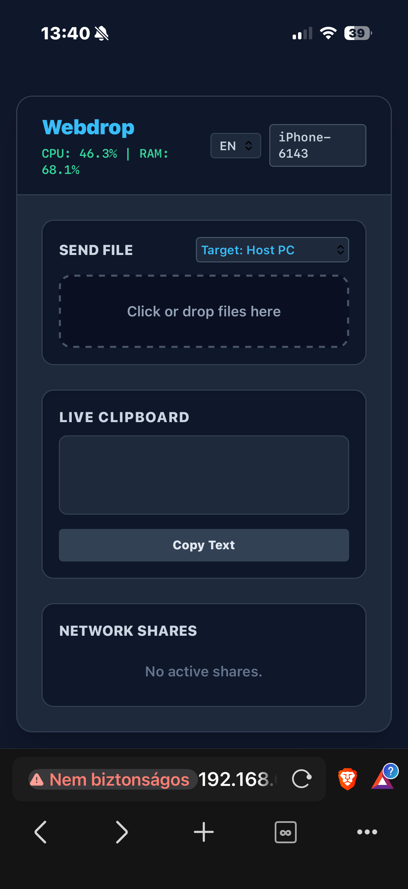
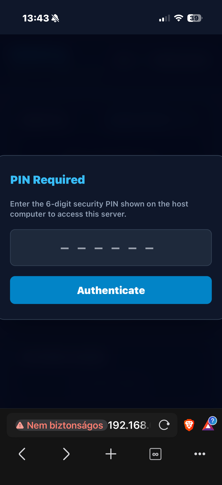

# Local Webdrop

[](https://www.python.org/)
[](https://fastapi.tiangolo.com/)
[](https://github.com/Gyuri125/local-webdrop)
[](LICENSE)

Local Webdrop is a high-performance, zero-configuration data transmission platform engineered for secure Local Area Network (LAN) operations. It establishes an encrypted bridge between desktop workstations and mobile clients, facilitating high-throughput file transfers, direct media streaming, and bidirectional clipboard synchronization without relying on public cloud infrastructure, external servers, or active WAN connectivity.

---

## Interface Preview

### Desktop Controller
| Main Workspace & Discovery | Synchronized Live Clipboard |
| :---: | :---: |
| <a href="docs/screenshots/desktop_main.png"></a> | <a href="docs/screenshots/desktop_clipboard.png"></a> |

### Web Client (Desktop Viewport)
| Dashboard Overview | Live Clipboard | Active Transfers & Relay |
| :---: | :---: | :---: |
| <a href="docs/screenshots/web_main.png"></a> | <a href="docs/screenshots/web_clipboard.png"></a> | <a href="docs/screenshots/web_transfer.png"></a> |

### Mobile Client & Security Workflow
| Mobile Viewport | 6-Digit PIN Authentication |
| :---: | :---: |
| <a href="docs/screenshots/mobile_main.png"></a> | <a href="docs/screenshots/mobile_auth.png"></a> |
---

## Architectural Highlights

* Complete Subnet Isolation: Data never transits outside the local broadcast domain. The application eliminates external telemetry, third-party relays, and persistent cloud footprints.
* End-to-End Transport Security: All HTTP and WebSocket communications are encrypted over TLS (HTTPS/WSS) with localized self-signed certificate support.
* Tokenized Access Control: Centralized PIN protection utilizes transient session tokens and IP-level rate limiting (automated lockouts after consecutive failed attempts) to prevent automated brute-force attempts.
* Low-Overhead Chunked Streaming: An asynchronous chunked file processing pipeline (5 MB buffer slices) ensures bounded memory consumption regardless of file payload sizes.
* Zero-Configuration Discovery: Native multicast DNS (Zeroconf/mDNS) broadcasts domain records for direct resolution at `webdrop.local`, complemented by localized dynamic QR pairing.
* In-Browser Byte-Range Media Streaming: Built-in HTTP range request parsing enables arbitrary seeking and instantaneous media playback across client browsers without requiring complete asset retrieval.
* Host Relay Pipeline: Enables transient peer-to-peer file exchanges between isolated mobile endpoints routed through host memory.
* Internationalization (i18n): Built-in runtime multi-language localization supporting English, Hungarian, German, and Russian across desktop and web interfaces.

---

## Multi-Monitor Operation

The native desktop controller is specifically architected for multi-display environments and mixed-resolution desktop arrangements:

* Per-Monitor DPI Virtualization: Rendering geometry, modal layers, and dynamically rendered QR vector bitmaps adjust their scale factors when migrating between high-DPI (4K) panels and standard display devices.
* Unbounded Coordinate Drop Target: The file staging engine abstracts native desktop drag-and-drop events across arbitrary virtual desktop coordinates, enabling direct asset placement from primary or auxiliary monitors.
* Workspace State Preservation: Window termination requests redirect runtime lifecycles into the background system tray, retaining window layout coordinates and desktop session caches upon restoration.

---

## Keyboard Shortcuts

| Key Binding | Target Scope | Operational Action |
| :--- | :--- | :--- |
| `Ctrl + V` | System Interface | Inject system clipboard contents into the real-time broadcast buffer |
| `Ctrl + C` | Desktop Staging | Mirror synchronized network clipboard data into the OS clipboard registry |
| `Ctrl + S` | File Buffer | Trigger background compression worker to aggregate files into a single ZIP |
| `Escape` | Web Application | Terminate active media streaming viewports and detach DOM playback instances |
| `Ctrl + Q` | Global Context | Flush pending transactions, close active WebSockets, and release host ports |

---

## System Architecture

```text
+-------------------------------------------------------------------------+
|                              LOCAL NETWORK                              |
|                                                                         |
|   +-----------------------+                 +-----------------------+   |
|   |  Mobile / Web Client  |                 |  Mobile / Web Client  |   |
|   +-----------+-----------+                 +-----------+-----------+   |
|               |                                         |               |
|       WSS / HTTPS (TLS)                         WSS / HTTPS (TLS)       |
|               |                                         |               |
|               +--------------------+--------------------+               |
|                                    |                                    |
|                                    v                                    |
|   +-----------------------------------------------------------------+   |
|   |                       HOST SERVER RUNTIME                       |   |
|   |                                                                 |   |
|   |  +--------------------+  Token Auth / Rate Limiting             |   |
|   |  |   FastAPI Engine   |<--------------------------+             |   |
|   |  | (Uvicorn / AsyncIO)|                           |             |   |
|   |  +---------+----------+                           |             |   |
|   |            |                                      |             |   |
|   |            v                                      v             |   |
|   |  +--------------------+                +---------------------+  |   |
|   |  |  State Repository  |<-------------->| CustomTkinter / DND |  |   |
|   |  | (In-Memory Buffer) |  Thread-Safe   |  Desktop Workspace  |  |   |
|   |  +--------------------+                +---------------------+  |   |
|   +-----------------------------------------------------------------+   |
+-------------------------------------------------------------------------+
```

---

## Tech Stack

* Backend Architecture: Python 3.10+, FastAPI, Uvicorn, AsyncIO, WebSockets
* Network Discovery & Security: Zeroconf (mDNS), Python SSL/TLS Engine, Dynamic Rate Limiting
* Desktop Interface: CustomTkinter, TkinterDnD2, Pystray (System Tray Integration)
* Web Frontend: ECMAScript 6+, Tailwind CSS Engine, HTML5 Media APIs
* Hardware & Platform Bindings: Psutil, Pillow (PIL), Plyer Notifications

---

## Getting Started

### Prerequisites

* Python 3.10 or higher
* All connecting endpoints joined to the same network subnet (Wi-Fi or Ethernet)
* Valid local SSL keypair (`webdrop_cert.pem` and `webdrop_key.pem`) in the project root directory

To generate the self-signed keypair manually:
```bash
openssl req -x509 -newkey rsa:2048 -keyout webdrop_key.pem -out webdrop_cert.pem -days 365 -nodes -subj "/CN=webdrop.local"
```

### Installation

1. Clone the repository:
   ```bash
   git clone [https://github.com/Gyuri125/local-webdrop.git](https://github.com/Gyuri125/local-webdrop.git)
   cd local-webdrop
   ```

2. Initialize an isolated virtual environment:
   ```bash
   python -m venv .venv
   
   # Windows (PowerShell):
   .\.venv\Scripts\Activate.ps1
   
   # Linux / macOS:
   source .venv/bin/activate
   ```

3. Install project dependencies:
   ```bash
   pip install -r requirements.txt
   ```

### Execution

Initialize the unified server engine and desktop application:

```bash
python main.py
```

1. Connect client devices by scanning the generated desktop QR code or directly loading the displayed endpoint (e.g., `https://192.168.X.X:8080` or `https://webdrop.local:8080`).
2. Accept the self-signed certificate warning on connecting client browsers.
3. If PIN protection is engaged, authenticate the client using the 6-digit dynamic host key.
4. Drag and drop file payloads onto the desktop interface to publish them, or upload directly from mobile viewports.

---

## License

This software is distributed under the terms of the MIT License. Refer to the [LICENSE](LICENSE) file for complete details.